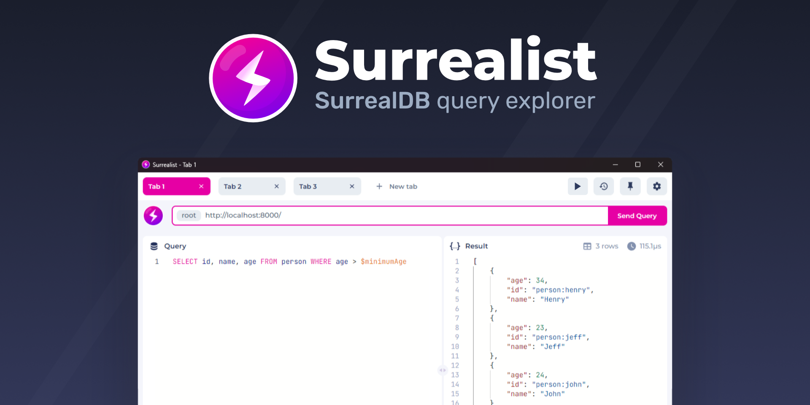
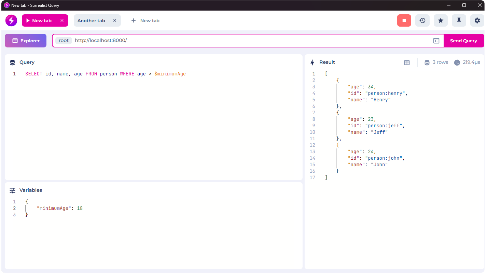
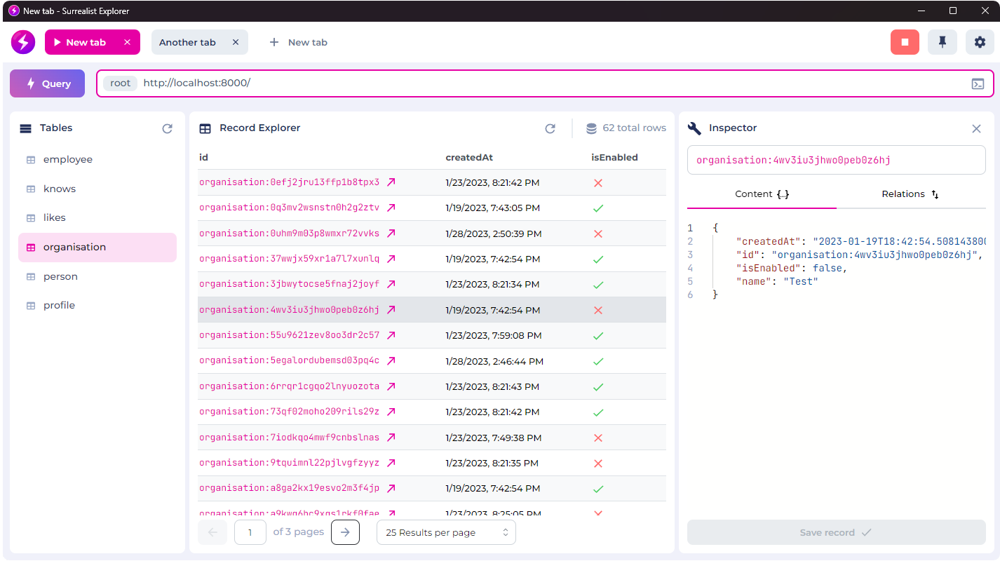

 

	

 

<h1 align="center">
	Surrealist for SurrealDB
</h1>

  
  
  
  

Surrealist is a simple to use Browser and Desktop based query playground and database explorer for [SurrealDB](https://surrealdb.com/). You can connect to any SurrealDB server and execute queries in a graphical interface, including table & variable auto completion, syntax highlighting, and much more. Switch to the explorer view to browse database tables, edit record contents, and traverse graph relationships. Use the designer view to create or modify your database schema, and manage logins and scopes with the authentication view.

## Features
- ⚡ SurrealQL syntax highlighting
- 🔍 Database explorer & record inspector
- ✏️ Full schema creation and modification
- 🔒 Manage database logins & scopes
- 📌 Define multiple sessions & environments
- 📋 Automatic table name completion
- 💫 Support for multiple queries in one request
- 🔭 Start a local database directly from the application
- 📜 Query history & Query favoriting

## How to use
You can [read our documentation](https://surrealist.starlane.studio/) for information on how to use Surrealist.

## Web App
You can use Surrealist by visiting https://surrealist.app/

While the web app provides a convenient and easy way to use Surrealist, the desktop app offers additional features such as an integrated database runner and offline support.

## Download
You can download the latest version of Surrealist Desktop from our [Releases](https://github.com/StarlaneStudios/Surrealist/releases) page.

### Running on MacOS with versions v1.6.0 or newer
Running Surrealist on MacOS is more complicated than on its Windows and Linux counterparts because our application is not signed. To run Surrealist on MacOS, please do the following:
- Navigate to your desired release (v1.6.0 and newer)
- Download the `surrealist-<version>-darwin.dmg` release file
- Open the executable
- When prompted, drag the Surrealist application into the "Applications" directory
- Navigate to your Applications directory
- Right-click on the Surrealist application and cick on open (Note: It is important to use right-click because for some reason left clicking to open does not work the first two times you run Surrealist)
- You will receive a prompt that says "Surrealist cannot be opened because the developer cannot be verified." Click on cancel
- Right-click on the Surrealist application and click on open again. This time you should receive a different prompt with an "Open" option. Click on open
- Surrealist should now launch, and you should now be able to launch Surrealist without issue from the Launchpad.

### Running on MacOS with versions prior to v1.6.0
We recommend that you use the latest Surrealist release. However, if you need to run an older release of Surrealist prior to version v1.6.0, follow these steps:
- Navigate to your desired release (any release prior to v1.6.0)
- Download the appropriate release file (select the arm64 for M1 and newer Macs and amd64 for Macs prior to M1)
- Extract the application from the tgz file
- Move the Surrealist executable to your Applications directory
- Delete the tgz file, as it is no-longer needed
- Open the Terminal app and navigate to the Applications directory by typing `cd /Applications`
- Run the command `sudo xattr -rd com.apple.quarantine Surrealist.app` (You may be prompted to enter your password)
- You should now be able to run Surrealist as normal from the Launchpad

If the steps for either of these MacOS processes do not work, please do not hesitate to open an issue.

## Local database
You can start a local database directly from the application by pressing the start button in the top right. Doing so will start up a SurrealDB instance using the credentials and port entered for the current tab.

You can choose whether the local database is stored in memory or stored on disk on the Settings screen.

This functionality is currently only available in the desktop app.

## Query view
Use the Query View to execute queries against your database. You can define variables in the Variables panel and use them in your queries, and browse the results in the Results panel.

Executed queries are saved to the Query History or can be manually saved to the Favorites panel to quickly access previous queries.

## Explorer view
The Explorer View is used to browse your database and inspect individual records. When you select a table in the left panel, the table contents will be displayed in the Record Explorer. You can click on a record id to open the Record Inspector, in which you can edit the record contents and traverse graph relationships.

## Contributing
We welcome any issues and PRs submitted to Surrealist. Since we currently work on multiple other projects and our time is limited, we value any community help in supporting a rich future for Surrealist.

Before you open an issue or PR please read our [Contributor Guide](CONTRIBUTING.md).

## Development
This project is built using [Tauri](https://tauri.app) and [React](https://reactjs.org/).

### Requirements
- [Rust](https://www.rust-lang.org/tools/install)
- [Nodejs LTS](https://nodejs.org/en/)
- [PNPM](https://pnpm.io/) (npm i -g pnpm)

### Live Development

To run in live development mode, run `npm run tauri:dev` in the project directory. This will run a Vite development
server that will provide very fast hot reload of your frontend changes.

### Building

To build a redistributable, production mode package, use `npm run tauri:build`.

## Maintainers

Surrealist is built and maintained by <a href="https://starlane.studio/">Starlane Studios</a> at no cost. If you would like to support our work feel free to [donate to us](https://paypal.me/ExodiusStudios) ⚡

## License

Surrealist is licensed under [MIT](LICENSE)

Copyright (c) 2022, Starlane Studios
