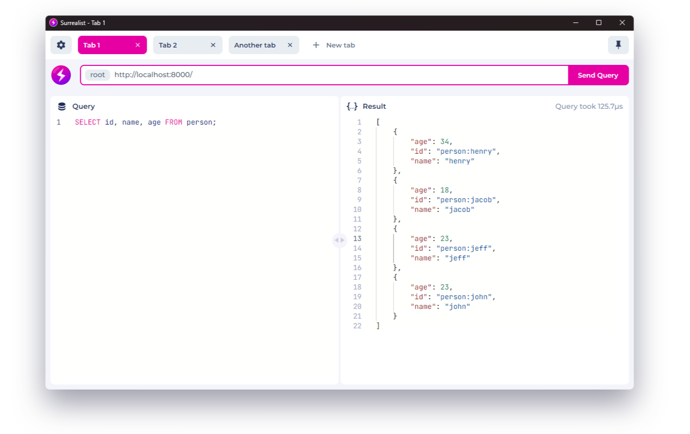

	
	

	

## About

Surrealist is a simple Desktop based query playground for [SurrealDB](https://surrealdb.com/). Easily and quickly connect to any SurrealDB database in order to execute and preview query responses.

This project is still in active development.

## Development
### Live Development

To run in live development mode, run `wails dev` in the project directory. This will run a Vite development
server that will provide very fast hot reload of your frontend changes. If you want to develop in a browser
and have access to your Go methods, there is also a dev server that runs on http://localhost:34115. Connect
to this in your browser, and you can call your Go code from devtools.

### Building

To build a redistributable, production mode package, use `wails build`.
