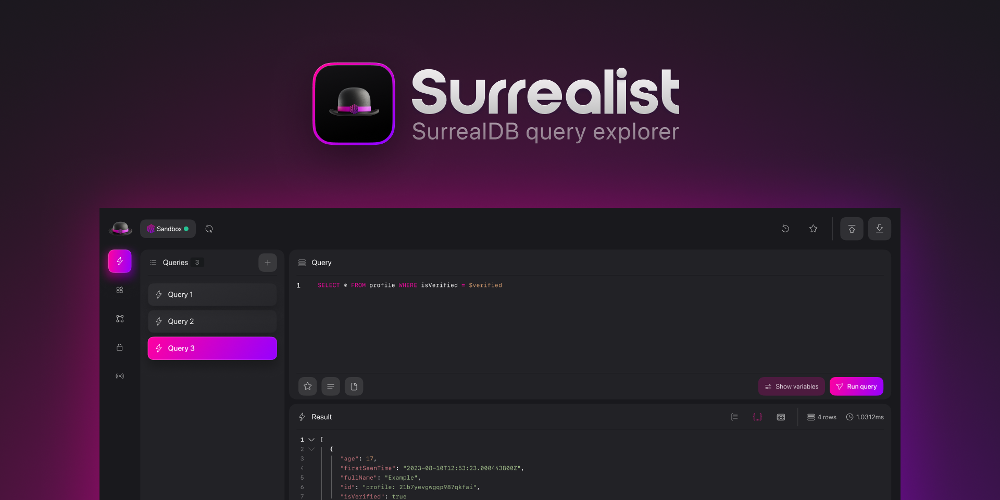

 

	

 

<h1 align="center">
  
</h1>

  

    
    &nbsp;
    
    &nbsp;
    
    &nbsp;
    
    &nbsp;
    

    
    &nbsp;
    
    &nbsp;
    
    &nbsp;
    
    &nbsp;
    
    &nbsp;
    
    &nbsp;
    
    &nbsp;
    

Surrealist is the ultimate way to visually manage your [SurrealDB](https://surrealdb.com/) database. Effortlessly connect to any SurrealDB database and execute queries, explore your tables and records, design your preferred schema, and much more. Surrealist is designed to suit a broad range of workflows, so whether you are pushing SurrealDB to its limits, or just getting started, Surrealist is the perfect tool to use.

## Documentation
You can [read our documentation](https://surrealdb.com/docs/surrealist) for information on how to install and get started using Surrealist.

## Using the Web App
The quickest way to jump into Surrealist is using the web app at https://surrealist.app/

The Surrealist web app provides a fully functional database management experience with support for multiple connections, an integrated sandbox environment, 

While the web app provides a full database management experience, it is recommended to download and install the desktop app for the complete Surrealist experience and gain features such as one-click database serving.

## Using the Desktop App
You can download the latest version of Surrealist Desktop from our [Releases](https://github.com/surrealdb/surrealist/releases) page. This version is the recommended way to interact with SurrealDB, as it supports additional features over the web app.

## Features

### Query view
Use the Query View to execute queries against your database. You can define variables in the Variables panel and use them in your queries, and browse the results in the Results panel.

Additionally, queries can be saved and organized in your Saved queries, while you can view a list of recent queries in the History drawer.

### Explorer view
The Explorer View is used to browse your database and inspect individual records. When you select a table in the left panel, the table contents will be displayed in the Record Explorer. You can click on a record id to open the record inspector, in which you can edit the record contents and traverse graph relationships.

### Designer view
The Designer View is a powerful tool you can use to define and manage your database schemas. You can create tables & edges, modify the database schema, and visualize the database tables in a graph view.

### Authentication view
Use the Authentication View to manage access to the database by creating namespace logins, database logins, or scopes.

### Functions view
Create and manage your schema level functions using the Functions view. Easily write your functions using the builtin SurrealQL editor, define their input parameters, and configure access permissions.

### Models view
Use the Models View to upload SurML files to the database and list out available machine learning models.

### API Docs view
The API Docs help you develop against your SurrealDB database faster by providing personalized API documentation in many available languages.

### Local database serving
Using the desktop app you can effortlessly start a local SurrealDB database directly from the interface, while following logging output from the console drawer.

You can choose whether the local database is stored in memory or stored on disk on the Settings screen.

### Sandbox
The Sandbox provides an easy to use playground to test, experiment, and learn SurrealDB. You can use the sandbox without having
to start a database up, and data will be reset after you close Surrealist. Additionally, you can use the buttons in the toolbar
to manually reset the sandbox or load an official dataset.

### Command Palette
For advanced usage Surrealist provides a command palette accessible using `cmd/ctrl + K` which allows you to easily navigate to any part of the interface and trigger any action.

### And much more
Explore the full list of features [in the docs](https://surrealdb.com/docs/surrealist).

## Contributing
We welcome any issues and PRs submitted to Surrealist. Before you open an issue or PR please read our [Contributor Guide](CONTRIBUTING.md).

## Disclaimer
- Surrealist aims to stay up-to-date with the latest stable release of SurrealDB. We cannot guarantee support for latest nightly builds.
- Connections to remote servers may require a HTTPS connection. You can easily configure SSL for your server using tools like Letsencrypt and nginx.

## License
Source code for Surrealist is licensed under the [MIT license](LICENSE).

Copyright © 2024 SurrealDB Ltd
