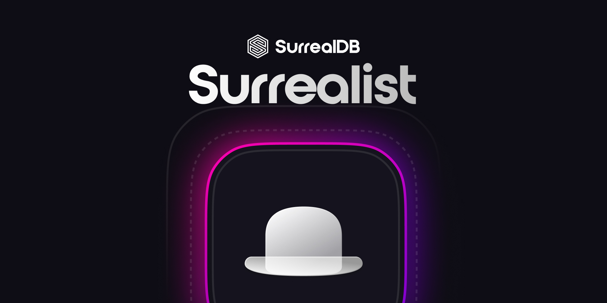
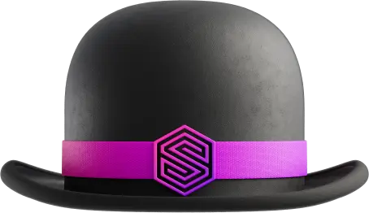

 

	

  

    
    &nbsp;
    
    &nbsp;
    
    &nbsp;
    
    &nbsp;
    

    
    &nbsp;
    
    &nbsp;
    
    &nbsp;
    
    &nbsp;
    
    &nbsp;
    
    &nbsp;
    
    &nbsp;
    

<h2>&nbsp;&nbsp;Surrealist is now SurrealDB Studio</h2>

Surrealist was the original user interface for interacting with [SurrealDB](https://surrealdb.com/) visually. It let you connect to any SurrealDB instance, run queries, explore tables, design schemas, and manage SurrealDB Cloud — and it served as the primary companion app for SurrealDB for years.

Surrealist has been superseded by **[SurrealDB Studio](https://surrealdb.com/studio)**, the successor to Surrealist and the recommended way to work with your data. Studio builds on what Surrealist started, with improved performance, easier navigation, and new ways to present your data.

**Get started with SurrealDB Studio:**

- [Download SurrealDB Studio](https://surrealdb.com/studio?download)
- [Open Studio in the browser](https://studio.surrealdb.com)

This repository remains available for historical reference and maintenance of the Surrealist codebase.

<h2>&nbsp;&nbsp;License</h2>

Source code for Surrealist is licensed under the [MIT license](LICENSE).

Copyright © 2026 SurrealDB Ltd
