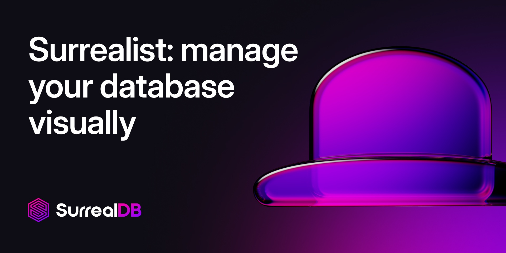

 

	

  

    
    &nbsp;
    
    &nbsp;
    
    &nbsp;
    
    &nbsp;
    

    
    &nbsp;
    
    &nbsp;
    
    &nbsp;
    
    &nbsp;
    
    &nbsp;
    
    &nbsp;
    
    &nbsp;
    

<h2>&nbsp;&nbsp;What is Surrealist?</h2>

Surrealist is a user interface for interacting with your [SurrealDB](https://surrealdb.com/) database visually. It enables you to seamlessly connect to any SurrealDB instance, allowing you to execute queries, explore your tables, design your schemas, and much more. Surrealist is designed to suit a broad range of workflows, so whether you are just getting started, or pushing SurrealDB to its limits, Surrealist is the perfect tool to use.

**Key features of Surrealist include:**

- **Visual querying** using the Query View, with support for query syntax highlighting, saved queries, and graph visualization.
- **Data exploration** using the Explorer View, where you can browse your tables, inspect records, and follow relationships.
- **Schema designing** using the Designer View, which generates a visual diagram of your database schema.
- **SurrealDB Cloud** management panel, allowing you to effortlessly provision and connect to your Cloud instances
- **Ask Sidekick** - a powerful AI assistant that helps you write queries, explore your data, and design your schema.

Learn more about Surrealist by visiting [the website](https://surrealdb.com/surrealist) or reading the [documentation](https://surrealdb.com/docs/surrealist).

<h2>&nbsp;&nbsp;Contents</h2>

- [Features](#features)
- [Learn SurrealDB](#Learn-SurrealDB)
- [Getting started](#Getting-started)
	- [Using the Web App](#Using-the-Web-App)
	- [Using the Desktop App](#Using-the-Desktop-App)
- [SurrealDB Cloud](#surrealdb-cloud)
- [Contributing](#contributing)
- [Disclaimer](#disclaimer)
- [License](#license)

<h2>&nbsp;&nbsp;Features</h2>

- [x] Query syntax highlighting
- [x] Data exploration with filtering support
- [x] GraphQL querying support with syntax highlighting
- [x] Visual schema creation and visualization
- [x] Write and manage your stored procedures and functions
- [x] Manage database access rules, user accounts, and resource permissions
- [x] Upload SurrealML models directly to your database
- [x] Auto-generated API documentation for your database
- [x] One-click local database serving
- [x] Sandbox environment for testing and learning
- [x] Command palette for quick navigation
- [x] Integrated AI assistant for asking questions and writing queries
- [x] SurrealDB Cloud management panel for provisioning instances

<h2>&nbsp;&nbsp;Learn SurrealDB</h2>

- SurrealDB University: https://surrealdb.com/learn/fundamentals
- Aeon's Surreal Renaissance (Interative book): https://surrealdb.com/learn/book
- Documentation: https://surrealdb.com/docs/surrealdb

<h2>&nbsp;&nbsp;Getting Started</h2>

Surrealist is easy to get started with, as we provide both a web app and a desktop app for you to use. While the web app is the quickest way to get started, the desktop app provides additional features such as local database serving and opening queries from disk.

### Using the Web App
Visit https://app.surrealdb.com/ to start using Surrealist in your browser.

### Using the Desktop App
You can download the latest version of Surrealist Desktop [here](https://surrealdb.com/surrealist?download) or find a list of releases on the [GitHub](https://github.com/surrealdb/surrealist/releases) page. This version is the recommended way to interact with SurrealDB, as it supports additional features over the web app.

<h2>&nbsp;&nbsp;SurrealDB Cloud</h2>

SurrealDB is available as a [hosted platform](https://app.surrealdb.app/signin). Forget about infrastructure operations, monitoring, backups or capacity planning. [SurrealDB Cloud](https://app.surrealdb.app/signin) allows you to focus on building great products using the power and flexibility of SurrealDB in just a few clicks. Grow from prototype to enterprise-scale. The SurrealDB Cloud scalable architecture allows your database to evolve as your application grows, ensuring you are always ahead of demand.

Surrealist features an integrated SurrealDB Cloud management panel, allowing you to effortlessly provision and connect to your Cloud instances, manage your billing, and monitor your usage. The SurrealDB Cloud panel is available in both the web and desktop apps.

<h2>&nbsp;&nbsp;Contributing</h2>

We welcome any issues and PRs submitted to Surrealist. Before you open an issue or PR please read our [Contributor Guide](CONTRIBUTING.md).

<h2>&nbsp;&nbsp;Disclaimer</h2>

- Surrealist aims to stay up-to-date with the latest stable release of SurrealDB. We cannot guarantee support for latest nightly builds.
- Connections to remote servers may require a HTTPS connection. You can easily configure SSL for your server using tools like Letsencrypt and nginx.

<h2>&nbsp;&nbsp;License</h2>

Source code for Surrealist is licensed under the [MIT license](LICENSE).

Copyright © 2025 SurrealDB Ltd
